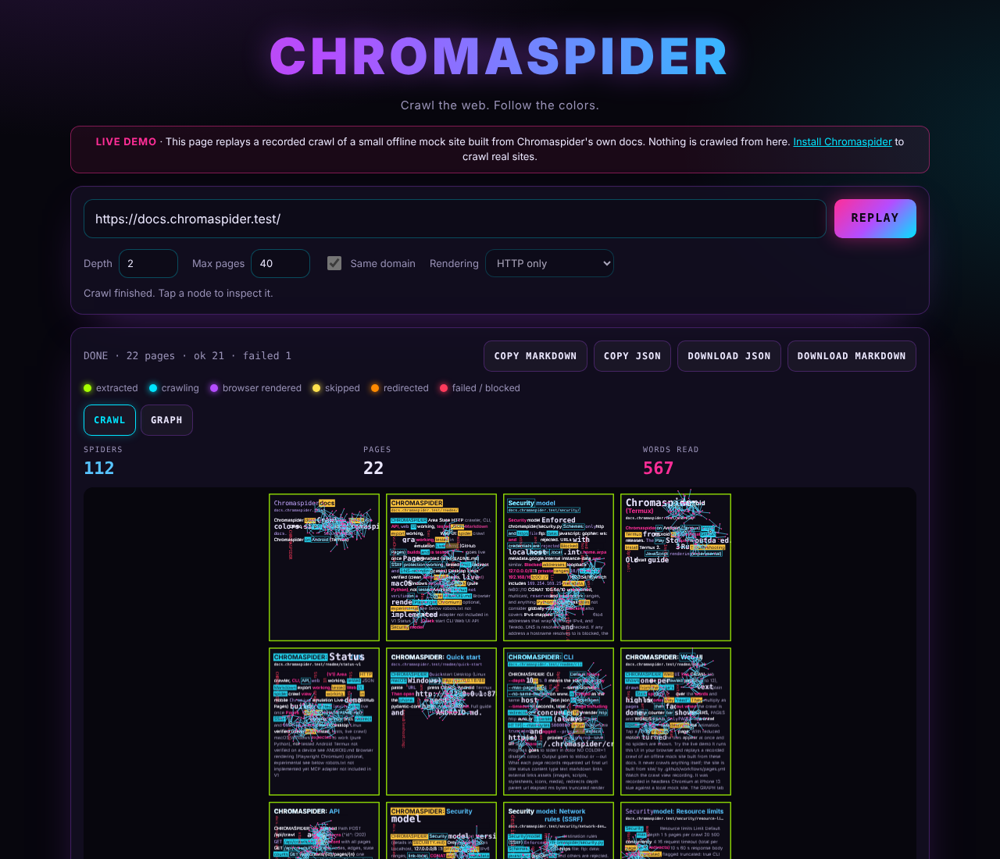
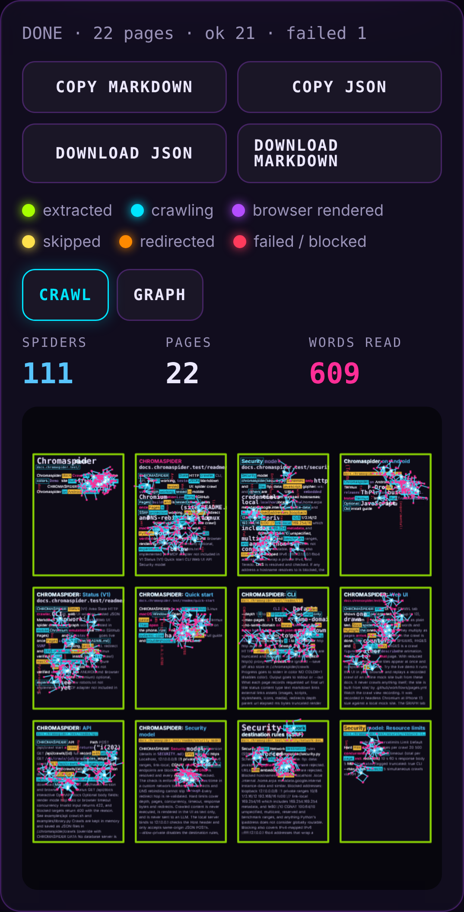
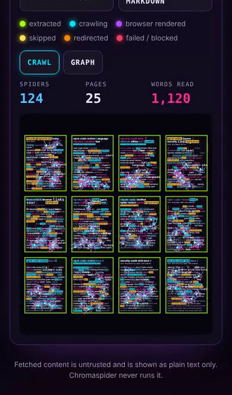

# CHROMASPIDER

**Crawl the web. Follow the colors.**

A small, colorful, agent-friendly web crawler. It runs in Python with no
Docker, Node, database or browser required. It outputs clean Markdown and
JSON, has a live neon crawl graph in the browser, and blocks SSRF by default.
It is built to run on an Android phone in Termux as well as on a desktop.

| Desktop | Phone-width |
| --- | --- |
|  |  |

*Real screenshots of crawling pypi.org, captured in headless Chromium on
Linux at desktop and 390 px phone widths. They were not taken on an Android
device.*

## Status (V1)

| Area | State |
| --- | --- |
| HTTP crawler, CLI, API, web UI | working, tested |
| JSON / Markdown export | working, tested |
| SSRF protection | working, tested (incl. redirect and DNS-rebinding cases) |
| Desktop Linux | verified (clean venv install, tests, live crawl) |
| macOS / Windows | expected to work (pure Python), **not tested** |
| Android / Termux | **not verified on a device**; see [ANDROID.md](ANDROID.md) |
| Browser rendering (Playwright / Chromium) | optional, **experimental**; see below |
| robots.txt | **not implemented yet** |
| MCP adapter | not included in V1 |

## Quick start

### Desktop (Linux / macOS / Windows)

```sh
git clone https://github.com/0xSneaks/chromaspider
cd chromaspider
python -m venv .venv && . .venv/bin/activate   # Windows: .venv\Scripts\activate
pip install -e .
chromaspider serve
```

Open **http://127.0.0.1:8788**, paste a URL and press **CRAWL**.

### Android / Termux

```sh
pkg update
pkg install python git rust
git clone https://github.com/0xSneaks/chromaspider
cd chromaspider
pip install -e .
chromaspider serve
```

Then open **http://127.0.0.1:8788** in Chrome on the phone. `rust` is needed
because `pydantic-core` has no Android wheel. Full guide and troubleshooting:
[ANDROID.md](ANDROID.md).

## CLI

```sh
chromaspider crawl https://example.com                       # JSON to stdout
chromaspider crawl https://example.com --output markdown --out site.md
chromaspider crawl https://example.com \
  --depth 2 \
  --max-pages 25 \
  --same-domain \
  --output json
chromaspider crawl https://example.com --no-same-domain --concurrency 8 --timeout 15
chromaspider crawl https://example.com --render auto         # use a browser if one is installed
chromaspider serve --port 8788
chromaspider doctor                                          # platform + optional backends
```

| Option | Default | Notes |
| --- | --- | --- |
| `--depth` | 1 | 0 to 5. 0 means the start page only |
| `--max-pages` | 20 | 1 to 500 |
| `--same-domain` / `--no-same-domain` | on | `www.` is treated as the same host |
| `--output` | json | `json` or `markdown` |
| `--timeout` | 10 | seconds, total per page including redirects |
| `--concurrency` | 4 | 1 to 16 |
| `--render` | http | `http`, `auto` or `browser` (always falls back to HTTP) |
| `--max-bytes` | 5000000 | larger bodies are truncated and flagged |
| `--proxy` | none | explicit http(s) proxy; env proxies are ignored |
| `--save` | off | also store in `~/.chromaspider/crawls` |

Progress goes to stderr in color (`NO_COLOR=1` disables color). Output goes
to stdout or `--out`.

### What each page records

`requested_url`, `final_url`, `title`, `status`, `content_type`, `text`,
`markdown`, `links`, `external_links`, `assets` (images, scripts,
stylesheets, icons, media), `redirects`, `depth`, `parent_url`,
`elapsed_ms`, `bytes`, `truncated`, `render_mode` (`http` or `browser`),
`render_note`, `state`, `error`, `timestamp`.

URLs are normalized before deduplication. Scheme and host are lowercased,
IDNA-encoded, default ports, fragments and dot-segments are removed, and
query parameters are sorted.

## Web UI

The **CRAWL** tab shows one tile per crawled page (up to 12), drawn from
the page's extracted text as plain text. Stick spiders walk over the words
and highlight the ones they "read". They multiply as pages arrive, then
fade out when the crawl is done. The counter bar shows SPIDERS, PAGES and
WORDS READ. Only PAGES is a crawl figure; the other two describe the
animation. Tap a tile to inspect that page. With reduced motion turned on,
the tiles appear at once and no spiders are shown.



**[Try the live demo](https://0xsneaks.github.io/chromaspider/)**. It runs this
UI in your browser and replays a recorded crawl of an offline mock site built
from these docs. It never crawls anything itself; the site is built from
`site/` by `.github/workflows/pages.yml`.
[Watch the crawl view recording](docs/crawl-view.mp4). It was recorded in
headless Chromium at iPhone 13 size against a local mock site.

The **GRAPH** tab polls the API while a crawl runs. Each node is a page,
and each line runs from parent to child.

| Color | Meaning |
| --- | --- |
| 🟢 green | extracted successfully |
| 🔵 cyan | crawling now |
| 🟣 violet | rendered with a browser |
| 🟡 yellow | skipped (non-HTML content, not parsed) |
| 🟠 orange | reached via redirect |
| 🔴 red | failed or blocked |

Tap a node to see its URL, title, status, timing, metadata, extracted
Markdown and outgoing links. The page has **COPY MARKDOWN**, **COPY JSON**,
**DOWNLOAD JSON** and **DOWNLOAD MARKDOWN** buttons for the whole crawl,
plus per-page copy buttons. The layout is mobile-first.

## API

| Method | Path | |
| --- | --- | --- |
| `POST` | `/api/crawl` | start a crawl, returns `{"id": ...}` (202) |
| `GET` | `/api/crawls/{id}` | full record with all pages |
| `GET` | `/api/crawls/{id}/graph` | nodes, edges, state counts |
| `GET` | `/api/crawls/{id}/pages/{n}` | one page |
| `GET` | `/api/crawls/{id}/export?format=json` | download JSON |
| `GET` | `/api/crawls/{id}/export?format=markdown` | download Markdown |
| `GET` | `/api/health` | version and browser backend status |
| `GET` | `/api/docs` | interactive OpenAPI docs |

```sh
curl -s -X POST http://127.0.0.1:8788/api/crawl \
  -H 'Content-Type: application/json' \
  -d '{"url": "https://example.com", "depth": 2, "max_pages": 20, "same_domain": true}'
# {"id":"3f2c...","status":"running"}

curl -s "http://127.0.0.1:8788/api/crawls/3f2c.../export?format=markdown"
```

Optional body fields: `render_mode` (`http`, `auto` or `browser`),
`timeout`, `concurrency`. Invalid input returns 422, and blocked targets
return 400 with the reason. See [`examples/api_crawl.sh`](examples/api_crawl.sh)
and [`examples/library.py`](examples/library.py).

Crawls are kept in memory and saved as JSON files in `~/.chromaspider/crawls`
(override with `CHROMASPIDER_DATA`). No database server is used.

## Security model

Short version (details in [SECURITY.md](SECURITY.md)):

* Only `http` and `https`. Localhost, `127.0.0.0/8`, `::1`, private IPv4
  and IPv6 ranges, link-local, CGNAT and cloud metadata endpoints are blocked
  by default.
* DNS is resolved and every resulting IP is checked. The check is enforced
  again **at connect time** in a custom network backend, so redirects and DNS
  rebinding cannot slip through. Every redirect hop is re-validated.
* Hard limits cover depth, pages, concurrency, timeout, response bytes and
  redirects.
* Crawled content is never executed, is rendered in the UI as text only,
  and is never sent to an LLM.
* The local server binds to `127.0.0.1`, checks the `Host` header and only
  accepts same-origin JSON POSTs.

`--allow-private` disables the destination rules, for crawling your own
local test sites only.

## Browser rendering: limitations

Rendering is an **optional adapter** (`BrowserRenderer.render(url) ->
RenderedPage`). The HTTP crawler never depends on it.

* `render_mode=http` (default): no browser.
* `auto` / `browser`: use **Playwright** if the `playwright` package is
  already installed (desktop), or a **Chromium binary** via `--dump-dom` (the
  experimental Termux path, also usable on desktop with
  `CHROMASPIDER_CHROMIUM=/path/to/chrome`). Chromaspider never installs
  browsers.
* If no backend exists, or it crashes, times out or returns a browser error
  page, the page is fetched over HTTP and marked `render_mode: "http"` with a
  `render_note`. It never pretends to have rendered.
* Successfully rendered pages are marked `render_mode: "browser"` and drawn
  violet.
* The Chromium adapter only lets the page's own host resolve, for SSRF
  safety, so third-party scripts and CDNs will not load.
* **Not verified:** a successful real-world browser render. In the
  development sandbox, Chromium hit TLS interception and the fallback path
  was exercised instead. The adapters' fallback logic is unit-tested.

## Architecture

```
chromaspider/
  cli.py          argparse CLI: crawl / serve / doctor
  crawler.py      bounded BFS crawler (asyncio workers, dedup, depth/page limits, manual redirects)
  extract.py      URL normalization, links, assets, text, HTML -> Markdown (BeautifulSoup)
  security.py     SSRF policy, DNS vetting, connect-time SafeBackend/SafeTransport
  models.py       pydantic models: CrawlRequest, PageResult, CrawlRecord
  graph.py        graph view + JSON / Markdown exports
  storage.py      in-memory store + JSON files
  server.py       FastAPI app, security headers, static UI
  browser/        optional renderers: base (disabled), desktop (Playwright), termux (Chromium dump-dom)
  static/         index.html, app.js, styles.css (no framework, no CDN)
tests/            pytest suite (no network needed)
examples/         API and library examples
```

Dependencies: `httpx`, `beautifulsoup4`, `fastapi`, `uvicorn`, `pydantic`.
Optional: `lxml` (`pip install -e .[lxml]`) and `playwright`.

## Development

```sh
pip install -e .[test]
pytest
```

The tests use mocked transports and local servers, so they need no internet
access.
