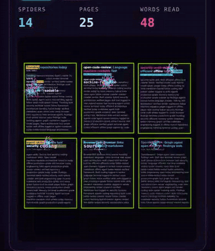
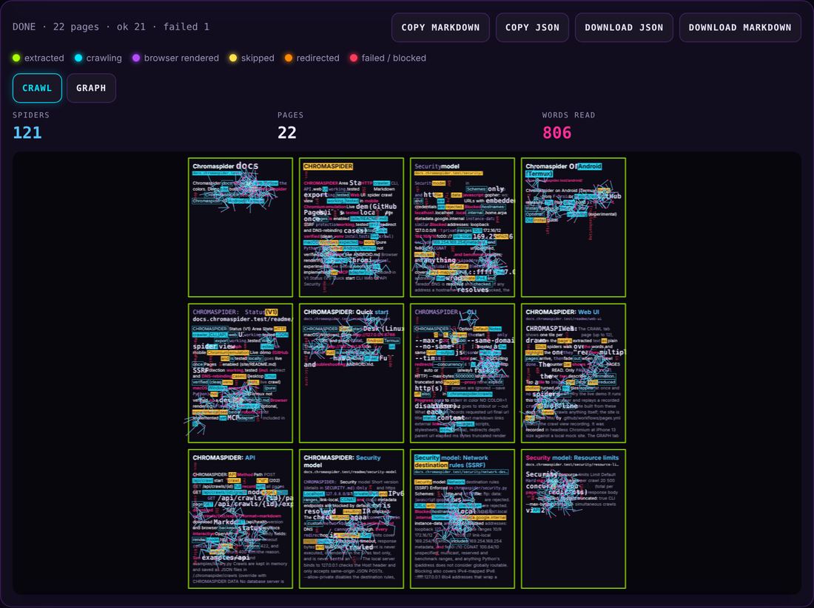
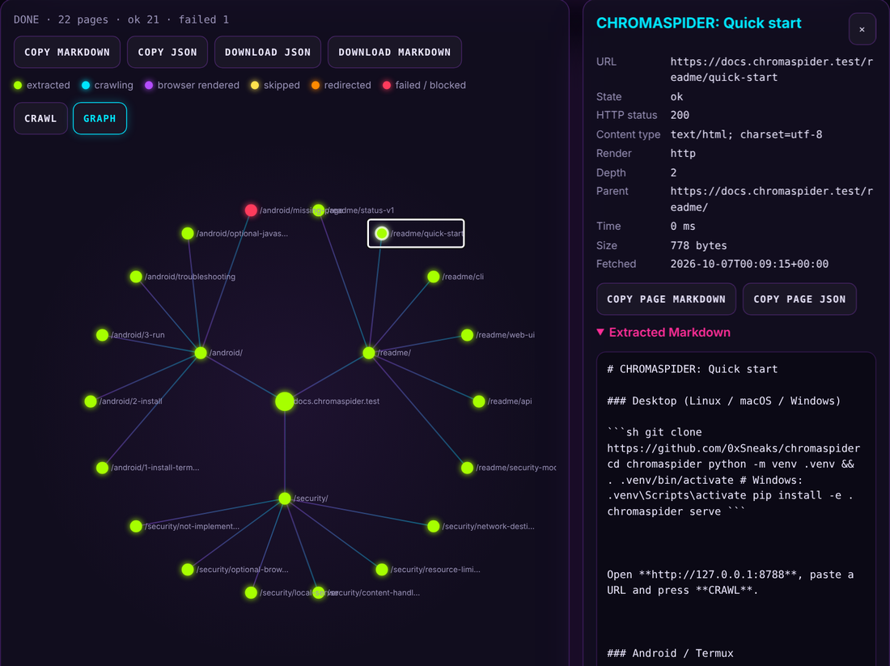

<p align="center">
  
</p>

<p align="center">
  <a href="https://github.com/0xSneaks/chromaspider/actions/workflows/tests.yml"></a>
  <a href="https://github.com/0xSneaks/chromaspider/releases/latest"></a>
  
  <a href="LICENSE"></a>
  <a href="https://chromaspider.vercel.app"></a>
</p>

<h3 align="center">The web crawler you can actually watch crawl. 🕷️</h3>

Point ChromaSpider at a site and a swarm of neon spiders goes to work on it:
they crawl across every page's text, highlight the words they read and
multiply as new pages turn up, while a live graph maps the site in color.
When they're done you get the whole crawl back as clean **Markdown** or
**JSON**, ready for notes, archives or an LLM.

Under the glow it's a small, careful crawler. It blocks requests to your own
network by default, obeys `robots.txt`, and needs nothing but Python: no
Docker, no database, no browser.

<p align="center">
  <a href="https://chromaspider.vercel.app"></a>
</p>

<p align="center">
  <b><a href="https://chromaspider.vercel.app">▶ Try the live demo</a></b>, with nothing to install
  (also on <a href="https://0xsneaks.github.io/chromaspider/">GitHub Pages</a>).<br>
  <sub>The demo replays a recorded crawl of a mock site built from these docs. It never crawls anything itself. <a href="site/README.md">How it works</a>.</sub>
</p>

## ✨ What you get

- 🕷️ **A crawl you can see.** The **CRAWL** view tiles up to 12 pages and lets
  stick spiders swarm their text. The **GRAPH** view draws the site map live,
  color-coded by what happened to each page. Tap anything to inspect it.
- 📄 **Clean output.** Every page comes back with its title, status, timing,
  text, Markdown, links and assets. Export the whole crawl as one Markdown or
  JSON file, or copy a single page.
- 🛡️ **Safe by default.** Localhost, private networks and cloud-metadata
  addresses are blocked, checked again at connect time and on every redirect,
  so a crawl can't be turned against the machine running it.
- 🤝 **Polite by default.** It obeys `robots.txt` (RFC 9309), honors
  `Crawl-delay`, and identifies itself as `Chromaspider/<version>`.
- ⚙️ **Three ways in:** a colorful **CLI**, a **JSON API**, and the **web UI**.
- 📱 **Runs where Python runs**, desktop or Android via Termux. The mobile-first
  UI works on a phone screen.

## 🚀 Quick start

```sh
git clone https://github.com/0xSneaks/chromaspider
cd chromaspider
python -m venv .venv && . .venv/bin/activate   # Windows: .venv\Scripts\activate
pip install -e .
chromaspider serve
```

Open **http://127.0.0.1:8788**, paste a URL and hit **CRAWL**. Depth 1–2
with 10–25 pages makes for a good-looking swarm.

Prefer the terminal?

```sh
chromaspider crawl https://example.com --output markdown --out site.md
```

<details>
<summary><b>📱 Android / Termux</b></summary>

```sh
pkg update
pkg install python git rust
git clone https://github.com/0xSneaks/chromaspider
cd chromaspider
pip install -e .
chromaspider serve
```

Then open **http://127.0.0.1:8788** in Chrome on the phone. `rust` is needed
because `pydantic-core` has no Android wheel. This setup has **not yet been
verified on a real device**. Full guide and troubleshooting:
[ANDROID.md](ANDROID.md).
</details>

## 🖥️ The web UI

| CRAWL: spiders reading every page | GRAPH: the site map, with a page open |
| --- | --- |
|  |  |

<sub>Screenshots of the live demo at desktop width, captured in headless
Chromium. The GIF above shows the same UI on a phone-sized screen.</sub>

**CRAWL** shows one tile per crawled page (up to 12), drawn from the page's
extracted text as plain text. Spiders walk the words and highlight the ones
they "read", multiply as pages arrive, then fade out when the crawl is done.
The counter bar shows SPIDERS, PAGES and WORDS READ. Only PAGES is a crawl
figure; the other two describe the animation. With reduced motion turned on,
the tiles appear at once and no spiders are shown.

**GRAPH** polls the API while a crawl runs. Each node is a page, and each line
runs from parent to child:

| Color | Meaning |
| --- | --- |
| 🟢 green | extracted successfully |
| 🔵 cyan | crawling now |
| 🟣 violet | rendered with a browser |
| 🟡 yellow | skipped (non-HTML content, or disallowed by robots.txt) |
| 🟠 orange | reached via redirect |
| 🔴 red | failed or blocked |

Tap a tile or node to see its URL, title, status, timing, metadata, extracted
Markdown and outgoing links. **COPY MARKDOWN**, **COPY JSON**, **DOWNLOAD
JSON** and **DOWNLOAD MARKDOWN** cover the whole crawl, and each page has its
own copy buttons. There's also a [21-second recording](docs/crawl-view.mp4) of
the crawl view.

## ⌨️ CLI

```sh
chromaspider crawl https://example.com                       # JSON to stdout
chromaspider crawl https://example.com --output markdown --out site.md
chromaspider crawl https://example.com --depth 2 --max-pages 25 --output json
chromaspider crawl https://example.com --no-same-domain --concurrency 8 --timeout 15
chromaspider crawl https://example.com --render auto         # use a browser if one is installed
chromaspider serve --port 8788
chromaspider doctor                                          # platform + optional backends
```

| Option | Default | Notes |
| --- | --- | --- |
| `--depth` | 1 | 0 to 5. 0 means the start page only |
| `--max-pages` | 20 | 1 to 500 |
| `--same-domain` / `--no-same-domain` | on | `www.` is treated as the same host |
| `--output` | json | `json` or `markdown` |
| `--timeout` | 10 | seconds, total per page including redirects |
| `--concurrency` | 4 | 1 to 16 |
| `--render` | http | `http`, `auto` or `browser` (always falls back to HTTP) |
| `--max-bytes` | 5000000 | larger bodies are truncated and flagged |
| `--proxy` | none | explicit http(s) proxy; env proxies are ignored |
| `--save` | off | also store in `~/.chromaspider/crawls` |
| `--ignore-robots` | off | don't fetch or obey `robots.txt` (only for sites you may crawl) |

Progress goes to stderr in color (`NO_COLOR=1` disables color). Output goes
to stdout or `--out`.

**What each page records:** `requested_url`, `final_url`, `title`, `status`,
`content_type`, `text`, `markdown`, `links`, `external_links`, `assets`
(images, scripts, stylesheets, icons, media), `redirects`, `depth`,
`parent_url`, `elapsed_ms`, `bytes`, `truncated`, `render_mode` (`http` or
`browser`), `render_note`, `state`, `error`, `timestamp`.

URLs are normalized before deduplication. Scheme and host are lowercased,
IDNA-encoded, default ports, fragments and dot-segments are removed, and
query parameters are sorted.

## 🔌 API

| Method | Path | |
| --- | --- | --- |
| `POST` | `/api/crawl` | start a crawl, returns `{"id": ...}` (202) |
| `GET` | `/api/crawls/{id}` | full record with all pages |
| `GET` | `/api/crawls/{id}/graph` | nodes, edges, state counts |
| `GET` | `/api/crawls/{id}/pages/{n}` | one page |
| `GET` | `/api/crawls/{id}/export?format=json` | download JSON |
| `GET` | `/api/crawls/{id}/export?format=markdown` | download Markdown |
| `GET` | `/api/health` | version and browser backend status |
| `GET` | `/api/docs` | interactive OpenAPI docs |

```sh
curl -s -X POST http://127.0.0.1:8788/api/crawl \
  -H 'Content-Type: application/json' \
  -d '{"url": "https://example.com", "depth": 2, "max_pages": 20, "same_domain": true}'
# {"id":"3f2c...","status":"running"}

curl -s "http://127.0.0.1:8788/api/crawls/3f2c.../export?format=markdown"
```

Optional body fields: `render_mode` (`http`, `auto` or `browser`), `timeout`,
`concurrency`, `respect_robots` (default `true`). Invalid input returns 422,
and blocked targets return 400 with the reason. See
[`examples/api_crawl.sh`](examples/api_crawl.sh) and
[`examples/library.py`](examples/library.py).

Crawls are kept in memory and saved as JSON files in `~/.chromaspider/crawls`
(override with `CHROMASPIDER_DATA`). No database server is used.

## 🛡️ Security model

Short version (details in [SECURITY.md](SECURITY.md)):

* Only `http` and `https`. Localhost, `127.0.0.0/8`, `::1`, private IPv4
  and IPv6 ranges, link-local, CGNAT and cloud metadata endpoints are blocked
  by default.
* DNS is resolved and every resulting IP is checked. The check is enforced
  again **at connect time** in a custom network backend, so redirects and DNS
  rebinding cannot slip through. Every redirect hop is re-validated.
* Hard limits cover depth, pages, concurrency, timeout, response bytes and
  redirects.
* Crawled content is never executed, is rendered in the UI as text only,
  and is never sent to an LLM.
* The local server binds to `127.0.0.1`, checks the `Host` header and only
  accepts same-origin JSON POSTs.

`--allow-private` disables the destination rules, for crawling your own
local test sites only.

## 🤝 robots.txt

By default ChromaSpider follows [RFC 9309](https://www.rfc-editor.org/rfc/rfc9309):

- It fetches `/robots.txt` once per site, through the same SSRF-safe
  connection as every other request.
- It matches rules for the `Chromaspider` user-agent first, then `*`.
- Disallowed pages are marked `skipped` with the reason, and their links are
  not followed. Redirect targets are checked too.
- A missing `robots.txt` (4xx) means everything is allowed. An unreachable
  one (5xx or a network error) means nothing on that site is crawled.
- `Crawl-delay` is honored between requests to the same site, capped at 5
  seconds.

Turn it off with `--ignore-robots` (CLI) or `"respect_robots": false` (API),
but only for sites you are allowed to crawl.

## 🌐 Browser rendering (experimental)

Rendering is an **optional adapter** (`BrowserRenderer.render(url) ->
RenderedPage`). The HTTP crawler never depends on it.

* `render_mode=http` (default): no browser.
* `auto` / `browser`: use **Playwright** if the `playwright` package is
  already installed (desktop), or a **Chromium binary** via `--dump-dom` (the
  experimental Termux path, also usable on desktop with
  `CHROMASPIDER_CHROMIUM=/path/to/chrome`). ChromaSpider never installs
  browsers.
* If no backend exists, or it crashes, times out or returns a browser error
  page, the page is fetched over HTTP and marked `render_mode: "http"` with a
  `render_note`. It never pretends to have rendered.
* Successfully rendered pages are marked `render_mode: "browser"` and drawn
  violet.
* The Chromium adapter only lets the page's own host resolve, for SSRF
  safety, so third-party scripts and CDNs will not load.
* **Not verified:** a successful real-world browser render. In the
  development sandbox, Chromium hit TLS interception and the fallback path
  was exercised instead. The adapters' fallback logic is unit-tested.

## 📋 Status

| Area | State |
| --- | --- |
| HTTP crawler, CLI, API, web UI | working, tested |
| JSON / Markdown export | working, tested |
| Spider crawl view + graph | working, tested in mobile Chromium emulation |
| Live demo | live on [Vercel](https://chromaspider.vercel.app) and [GitHub Pages](https://0xsneaks.github.io/chromaspider/); redeploys on every push to `main` |
| SSRF protection | working, tested (incl. redirect and DNS-rebinding cases) |
| robots.txt | obeyed by default (RFC 9309, incl. capped `Crawl-delay`) |
| Tests | run on Python 3.10, 3.12 and 3.13 for every change |
| Desktop Linux | verified (clean venv install, tests, live crawl) |
| macOS / Windows | expected to work (pure Python), **not tested** |
| Android / Termux | **not verified on a device**; see [ANDROID.md](ANDROID.md) |
| Browser rendering | optional, **experimental** |
| MCP adapter | not included yet |

## 🧩 Architecture

```
chromaspider/
  cli.py          argparse CLI: crawl / serve / doctor
  crawler.py      bounded BFS crawler (asyncio workers, dedup, limits, manual redirects, robots.txt)
  extract.py      URL normalization, links, assets, text, HTML -> Markdown (BeautifulSoup)
  security.py     SSRF policy, DNS vetting, connect-time SafeBackend/SafeTransport
  models.py       pydantic models: CrawlRequest, PageResult, CrawlRecord
  graph.py        graph view + JSON / Markdown exports
  storage.py      in-memory store + JSON files
  server.py       FastAPI app, security headers, static UI
  browser/        optional renderers: base (disabled), desktop (Playwright), termux (Chromium dump-dom)
  static/         index.html, app.js, viz.js, wall.js, styles.css (no framework, no CDN)
site/             live demo: build script, replay shim, recorded crawl (deployed to Pages and Vercel)
tests/            pytest suite (no network needed); tests/js/ holds Node UI tests
examples/         API and library examples
```

Dependencies: `httpx`, `beautifulsoup4`, `fastapi`, `uvicorn`, `pydantic`.
Optional: `lxml` (`pip install -e .[lxml]`) and `playwright`.

## 🛠️ Development

```sh
pip install -e .[test]
pytest
```

The tests use mocked transports and local servers, so they need no internet
access. If Node.js is installed, `pytest` also runs the UI tests in
`tests/js/`; you can run them directly with
`node --test tests/js/viz.test.js tests/js/demo.test.js`. GitHub Actions runs
everything on Python 3.10, 3.12 and 3.13 for every pull request.

Issues, ideas and pull requests are welcome.

## 📜 License

MIT. See [LICENSE](LICENSE).
